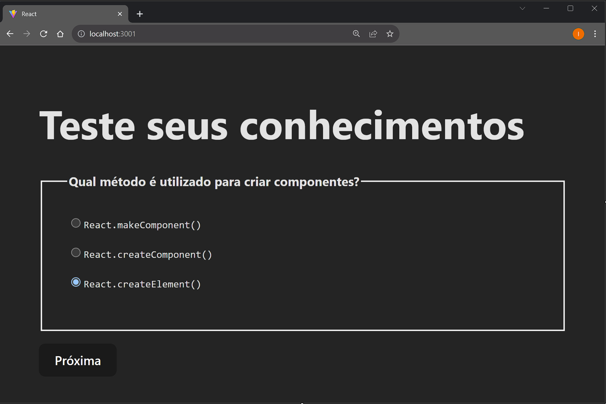

# React Questions

## Descrição

Este projeto é um pequeno exercício do curso React Completo do Origamid para entender o funcionamento de componentes e estados no React.

Ele é desenvolvido com Vite + React e consiste em uma aplicação simples que permite ao usuário testar seus conhecimentos com 4 perguntas simples sobre react.



## Requisitos

- Node.js >= 16.14
- Yarn ou NPM

## Como usar

1. Clone o repositório:

```
git clone https://github.com/[seu-nome]/exercicio-react.git
```

2. Instale as dependências:

```
npm install ou yarn install
```

3. Inicie o servidor:

```
npm run dev
```

A aplicação será aberta no navegador em http://localhost:3001.
